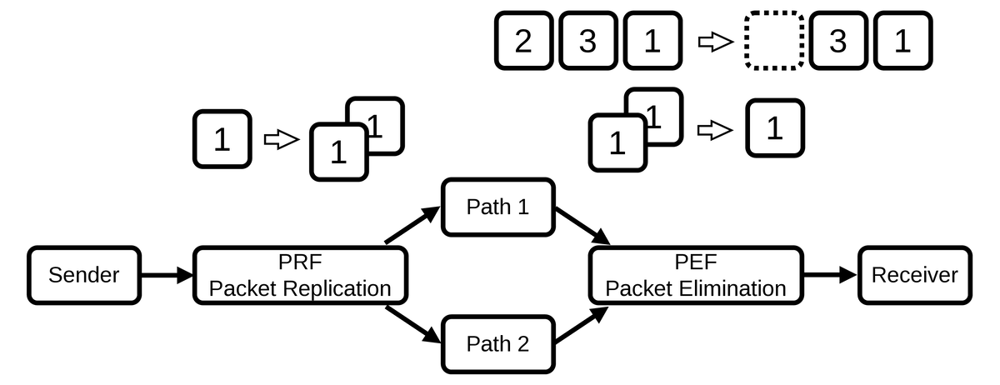
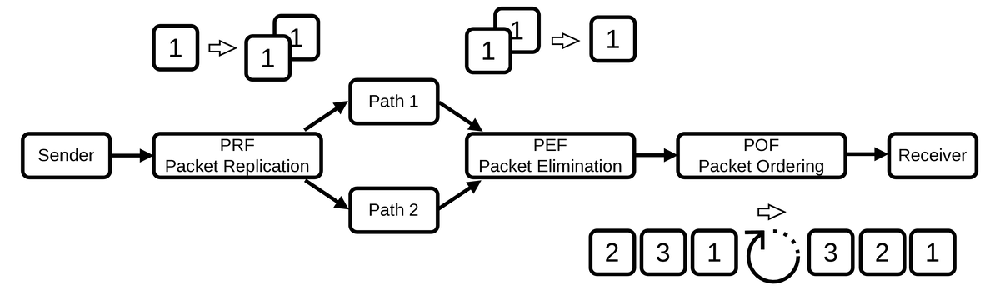
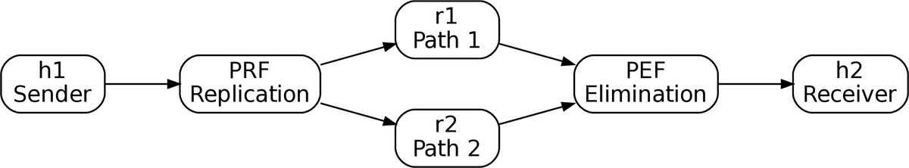

# miniDET

**miniDET** is a lightweight experimental implementation of a subset of the
Deterministic Networking (DetNet) Packet Replication, Elimination, and Ordering
Functions (PREOF) for commodity IP networks.

This repository accompanies the paper:

> **miniDET: A Lightweight Experimental Implementation of a DetNet PREOF Subset for Commodity IP Networks**

miniDET is intended for education, experimentation, and reproducible research.
Rather than implementing the complete DetNet architecture, it provides a
minimal PREOF subset that focuses on packet replication and duplicate
elimination.

---

## Proposed miniDET Architecture

<p align="center">

</p>

**Figure 1.**
Proposed lightweight PREOF subset implemented by miniDET.

## Background: PREOF Concept

<p align="center">
  
</p>

**Figure 2.**
Standard DetNet PREOF packet processing (RFC 8655).

---

# Features

- User-space Python implementation
- Packet Replication Function (PRF)
- Packet Elimination Function (PEF)
- Containerlab-based experimental topology
- Reproducible experiment scripts
- Example experimental results

---


# Requirements

The experiments were tested with:

- Ubuntu 24.04 LTS
- Docker Engine 29.x
- containerlab 0.77 or later
- Python 3.12

The following software must be installed before running the experiments:

- Docker Engine
- containerlab

Installation instructions are available from the official websites:

- Docker: https://docs.docker.com/engine/install/
- containerlab: https://containerlab.dev/install/

---

# Quick Start

Clone the repository.

```bash
git clone https://github.com/yama97/miniDET.git
cd miniDET
```

Ensure that the Docker daemon is running.

```bash
sudo systemctl start docker
```

Build the local Docker image used by the experiment nodes.

```bash
sudo docker build -t detnet-preof-lab:ubuntu24 .
```

If the repository was downloaded as a ZIP archive and the scripts are not executable, restore the executable permissions.

```bash
chmod +x *.py
chmod +x scripts/*.sh
chmod +x scripts/*.py
```

Deploy the containerlab topology.

```bash
sudo containerlab deploy -t preof.clab.yml
```

Verify that all containers are running.

```bash
sudo docker ps
```

You should see the following six containers.

```
clab-preof-h1
clab-preof-prf
clab-preof-r1
clab-preof-r2
clab-preof-pef
clab-preof-h2
```

Run the experiments.

```bash
sudo ./scripts/run-batch.sh
```

Analyze an individual experiment.

```bash
python3 ./scripts/analyze-run.py \
results/<experiment-directory>
```

Remove the topology.

```bash
sudo containerlab destroy -t preof.clab.yml --cleanup
```

---

## Experimental Topology

<p align="center">

</p>

**Figure 3.**
Containerlab-based experimental topology.

---


# Experimental Results

Example experiment results are included in the `results/` directory.

The analysis scripts generate:

- packet delivery rate
- residual packet loss
- duplicate packet statistics
- CSV summaries
- publication-quality figures

---

# Notes

The experiment programs

- sender-flow.py
- prf.py
- prf-onepath.py
- pef-history.py
- receiver-flow.py

are automatically mounted into the appropriate containers by
`preof.clab.yml`.

No manual `docker cp` operations are required.

---

# Reproducibility

This repository contains the complete artifact used in the
paper, including

- source code
- Docker environment
- containerlab topology
- experiment scripts
- analysis scripts
- representative experiment results

---

# License

BSD 3-Clause License.

---

# Citation

If you use miniDET in your research, please cite the following paper:

> S. Yamamoto and K. Fukuda,  
> “miniDET: A Lightweight Experimental Implementation of a DetNet PREOF Subset for Commodity IP Networks,”  
> in *2026 4th International Conference on Advanced Network Technologies and Applications (APAN)*, Auckland, New Zealand, 2026, pp. 1–6,  
> doi: [10.1109/APAN70967.2026.11709678](https://doi.org/10.1109/APAN70967.2026.11709678).

IEEE Xplore: https://ieeexplore.ieee.org/document/11709678


## BibTeX

```bibtex
@INPROCEEDINGS{11709678,
  author={Yamamoto, Seiichi and Fukuda, Kensuke},
  booktitle={2026 4th International Conference on Advanced Network Technologies and Applications (APAN)},
  title={miniDET: A Lightweight Experimental Implementation of a DetNet PREOF Subset for Commodity IP Networks},
  year={2026},
  volume={},
  number={},
  pages={1-6},
  keywords={Sequences;Sequential analysis;Radio access networks;Regional area networks;History;Fluid flow;Packet loss;IP networks;Design methodology;Linux;Deterministic Networking (DetNet);Packet Replication;Elimination;Ordering Functions (PREOF);packet delivery;residual packet loss;Research and Education Networks (REN);containerlab;reproducibility},
  doi={10.1109/APAN70967.2026.11709678}
}

